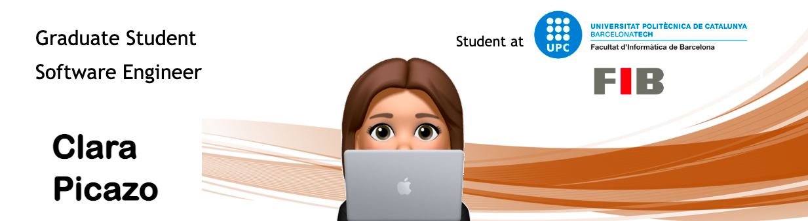
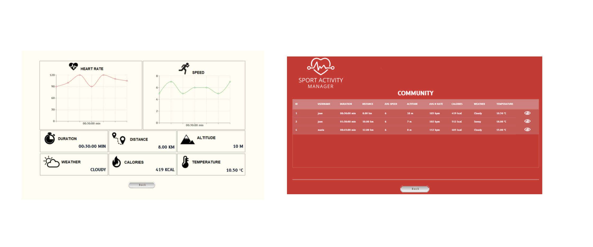

<!-- <h2 align='center'>Clara Picazo Ventaja @ clarethe</h2>

<b>Graduate Student at Universitat Politecnica de Catalunya </b>
 -->

<h2>Hey! 👋</h2>

 

I'm Clara Picazo! 
- <i>Currently:</i> I'm working in Sopra Steria as Javascript Developer (Barcelona). 
- <i>Previously:</i> I worked as an intern at CIT UPC.

<h2>Currently Learning</h2>

__Udemy 💻__
- JavaScript and ES6: The Latest in JS with Real Projects
- Clean Code in JavaScript

<h2>Currently working:</h2>

__Chatbots project (for 10 months) 🤖__

Programming JavaScript, NodeJS, WebPack, AWS services (e.g. S3, DynamoDB, EC2) .

<h2>Check out my work:</h2>

<h4>Sport activity manager</h4>
The project involves the development of a pilot test to record the physical training of athletes. 
It also integrates the sharing of its activities with other users through the use of blockchain technology:

https://upcommons.upc.edu/handle/2117/335306?locale-attribute=en

<h2> About me:</h2>

I enjoy working in a team and learning new technologies. I would like to learn, improve and gain responsibility over time. Outside of technology, I am involved in martial arts and I love theater, music and traveling whenever I can!
 
<h5>📫 How to reach me:</h5>

 

